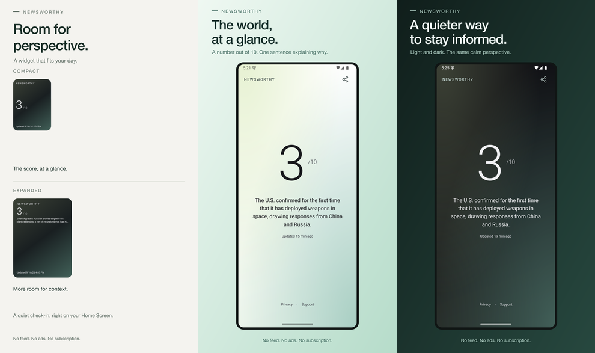

# Newsworthy store release

One place for the mobile listings, artwork, evidence, and remaining work.
Resume from [the release ledger](ledger.md) with the reusable
[app-release skill](https://github.com/astrojams1/skills/tree/main/skills/app-release).
**September 21, 2026 update:** the owner supplied Apple's Guideline 4.2
rejection of **build 7** for minimum functionality. The owner reports submitting the reconsideration reply; provider readback
is pending. Do not send a duplicate.
See [the exact reply and handoff](apple-4.2-reconsideration.md).
**September 22 TestFlight update:** iOS **1.0.0 (15)** was built from merged
main `65cafc3` with widget alignment and story-age changes. Apple processed it
as VALID, and it is IN_BETA_TESTING in Release QA; test notes were saved and
verified. See [build 15 evidence](testflight-15.json).
Physical-device verification of this build remains pending.

Neither app is publicly released. Earlier submission/video evidence remains
historical; the September 17 Waiting for Review result is superseded.

The iPhone lead compares real small and medium widgets on a neutral canvas,
without stock wallpaper or unrelated app icons. Updated iPhone/iPad reading
captures show the approved design and Privacy/Support footer.

**Additional Android QA:** maximum system text size exposed compact-widget
text clipping and stale app appearance after returning from Settings. AAB10
is superseded by completed production AAB11. See [the native evidence](android-large-text-verification.json);
corrective APK10 passed the Android emulator reproduction in both theme
directions and at maximum text size. The original font scale is restored.

Android version 7 exposed a widget refresh loop that flickers and interrupts
resizing. APK8 passed idle and scheduled-refresh checks without recurring
widget recreation. A theme switch exposed a separate denominator contrast issue;
APK9 passed native light/dark/light widget transitions. Current
reading and widget images are refreshed from APK9. The owner approved the smaller
widget; its actual 2×2 rendering and launcher span are now verified. The gallery
compares compact and expanded captures at one scale on a neutral canvas. The
earlier production AAB9 is superseded; production AAB10 finished from merged
commit `34f2570` and is now superseded by AAB11 from PR94 source, also downloaded
and SHA-256/ZIP validated. Google account verification
still blocks app creation. See the ledger for current gates and exact next actions.




## Contents

| File or folder | Purpose |
|---|---|
| [ledger.md](ledger.md) / [ledger.json](ledger.json) | Canonical resumable gates, evidence and event history |
| [listing.json](listing.json) | Canonical English copy, URLs, review notes, and US$1 paid-download target |
| [assets/](assets/) | Upload-ready PNGs and dimension/platform manifest |
| [source/](source/) | Original native captures and editable SVG layouts |
| [release.json](release.json) | Public app/build identifiers; no credentials |
| [user-actions.md](user-actions.md) | Verified account-owner steps with instructions |
| [apple-review-response.md](apple-review-response.md) | Posted Guideline 2.1 response and recording checklist |
| [apple-physical-review-video.json](apple-physical-review-video.json) | Recording hashes, preparation, attachment and observed verification scope |
| [apple-review-resubmission.json](apple-review-resubmission.json) | Confirmed build 7 Waiting for Review readback |
| [disclosures.md](disclosures.md) | Evidence for privacy and content declarations |
| [scripts/](scripts/) | Reproduce, validate, and upload the Apple listing |

## Verified status

- **Apple listing:** name `Newsworthy: Calm News`, English description,
  promotional text, subtitle, keywords, URLs, News category, and **five
  screenshots** saved. Apple reports every image `COMPLETE`: three 6.9-inch
  iPhone images and two 13-inch iPad images.
- **Apple pricing:** US$1.00 saved with local equivalents. Paid Apps Agreement
  was **Pending User Info** at the last live check after owner acceptance.
  Apple Business now confirms the W-9 is **Active**; banking remains outstanding. The address-correction request
  has been sent and acknowledged by Apple,
  but the obsolete legal address still needs Apple approval/correction.
- **Apple binary:** production **build 7** passed Apple validation, uploaded,
  processed `VALID`, and is selected for version 1.0.0. Production and Apple build
  IDs plus hashes are in `release.json`. Earlier builds remain historical evidence.
- **Apple age rating:** declaration saved and verified through the API. It
  accounts for recurring war/weapons and mature news, with no graphic imagery.
  Apple returned `SEVENTEEN_PLUS` in its legacy age-rating field and 18 in
  the France/Brazil fields; final localized ratings are store-calculated.
- **Google account:** registration paid; Play Console explicitly reported
  **identity verified successfully**. Real Android device verification remains;
  phone verification is disabled until that prerequisite is complete. **Create
  app is disabled**, so no Google app, price, listing, or release has been saved.
- **Android binary:** production AAB11 downloaded and SHA-256/ZIP-validated
  from clean PR94 source `8055d61`; it supersedes AAB10. Preview APK8 verified the
  refresh-loop fix: zero widget recreations in 65 seconds versus 30 in 34 seconds
  before the fix. Installed APK9 additionally passed theme transitions and
  compact 2×2 rendering; its compact/expanded gallery is complete. Native APK
  testing and AAB archive validation are distinct scopes. Build hashes and
  evidence are in `release.json` and `android-widget-regression.json`.
- **Apple review details:** contact information, phone, no-login requirement,
  and review notes saved and verified. Private contact details are not in Git.
- **Apple compliance:** the owner published App Privacy and completed the DSA
  declaration; the Business page reports DSA compliance **Active**.
- **Apple review:** the owner supplied the September 21 **Guideline 4.2
  rejection** of build7. The owner reports submitting the reconsideration reply; see
  [reply status](apple-4.2-reconsideration.md). Live API readback confirms version **REJECTED** and submission
  **UNRESOLVED_ISSUES**; earlier WAITING_FOR_REVIEW evidence is historical.
  Banking and Paid Apps Agreement activation remain separate public-sale gates.

## Reproduce the artwork

From the repository root after `npm ci`:

```sh
node store/scripts/render.mjs
node store/scripts/validate.mjs
```

The renderer extends the existing mint/charcoal vector identity. Original native
screens remain unchanged inside the layouts; resizing and framing are presentation
only. It never generates a score or news sentence. Keep screenshot claims aligned
with [product messaging](../docs/product-messaging.md).

Apple screenshots use EAS simulator build `e02851c0-0cae-4f95-b854-2d57e32cc0b2`
from commit `b5571c5`, on iPhone 16 Pro Max and iPad Pro 13-inch M4 / iOS 18.3.
The simulator bundle itself reports build 1 despite EAS remote metadata saying 6;
the separately validated production IPA is build 6. Per-device provenance JSONs
record that distinction and capture checksums.

The widget artboard uses unchanged surfaces from real small/medium Home Screen
widgets, framed with SVG viewports on plain off-white. It is an editorial
composition, not a claim that simulator wallpaper was changed. Medium preserves
its actual two-line truncation. Original full screenshots remain available.
All five replacement images were read back COMPLETE in the correct order; see
[Apple gallery verification](apple-gallery-verification.json). Native simulator
checks do not establish physical-device certification.

Android reading assets now use `12-reading-light-v9.png` and
`13-reading-dark-v9.png`, from preview APK9
`bfb5310e-c8e1-41af-bc01-6037b17701b6` on the API35 ARM64 emulator
(1080×2400). `provenance-v9.json` records hashes and native verification scope.
The renderer frames them as 1080×1920 Google Play images. Earlier captures,
including About and offline evidence, remain historical source files and are
excluded from the current gallery.

The widget renderer expects `source/android-phone/widget-frames.json` to identify
actual compact/expanded captures, viewport bounds, and the verified `versionCode`.
It then creates a versioned widget comparison as the first Android gallery image.
The expanded widget passed light→dark→light contrast checks without a worker run.
The compact dark capture shows the actual 2×2 state approved by the owner, with
launcher span/minimum independently read back as 2×2. Compact light was also verified on September 17 after a theme switch. Score 10,
large text and physical-device checks remain unverified. Automated design-contract
coverage and its limits are documented in [the design system](../design/README.md).

The pasted macOS crash report identified Android Emulator startup, not
Newsworthy. Local emulator library/resource paths were corrected, and the
emulator then booted and ran the earlier APK successfully.

## Update Apple through its API

Keep the private `.p8` key in 1Password or a local secret location. Set
`ASC_KEY_ID`, `ASC_ISSUER_ID`, and `ASC_PRIVATE_KEY_PATH` in the local environment.
Never paste the private key into this repository or commit environment files.

```sh
node store/scripts/apple.mjs status
node store/scripts/apple.mjs metadata
node store/scripts/apple.mjs screenshots
node store/scripts/apple.mjs build
node store/scripts/apple.mjs age-rating
node store/scripts/apple.mjs status
```

`metadata` saves the canonical copy and reads it back. `screenshots` creates
missing sets/assets and uploads through Apple's returned operations; it refuses
to overwrite a different remote image with the same name. Check `status` until
each asset is `COMPLETE`. `build` selects the processed Apple build recorded in
`release.json`. These commands do not sign agreements or submit App Review.
The optional `review-notes` command requires an owner-approved contact phone in
`ASC_REVIEW_PHONE` when creating the review section; Apple rejects creation
without it. Keep that value outside the repository.

## Account links

- [App Store Connect listing](https://appstoreconnect.apple.com/apps/6812519450/distribution)
- [Apple Business: contracts, banking, tax](https://appstoreconnect.apple.com/business)
- [Apple Developer account](https://developer.apple.com/account/)
- [Google Play Console](https://play.google.com/console/)
- [Expo builds](https://expo.dev/accounts/astrojams1/projects/newsworthy/builds)
- [Live app](https://newsworthy-indol.vercel.app/), [privacy](https://newsworthy-indol.vercel.app/privacy), [support](https://newsworthy-indol.vercel.app/support)

## What Expo covers

EAS builds the native packages, manages signing credentials and uploads binaries.
EAS Metadata can manage supported Apple listing text. Account verification,
contracts, banking/tax declarations, Google testing eligibility, and final store
review remain store-controlled. Apple's API can automate screenshots and other
listing work; that is why this repository includes its own small upload script.

References: [Expo submission](https://docs.expo.dev/deploy/submit-to-app-stores/),
[EAS Metadata](https://docs.expo.dev/eas/metadata/getting-started/),
[Apple screenshot specifications](https://developer.apple.com/help/app-store-connect/reference/app-information/screenshot-specifications),
[Apple screenshot API](https://developer.apple.com/documentation/appstoreconnectapi/app-screenshots),
[Google listing assets](https://support.google.com/googleplay/android-developer/answer/9866151).

Binary archives, local SDKs/emulators, credentials, personal addresses, tax
identifiers, phone numbers, and banking details stay out of this public repository.
Build links and sanitized status belong here; build/signing mechanics are in the
[mobile release guide](../docs/mobile-release.md).
