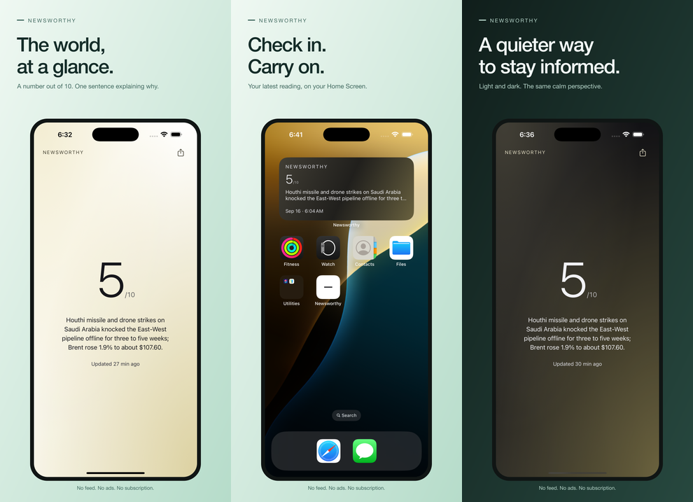

# Newsworthy store release

One place for the mobile listings, artwork, evidence, and remaining work.
Resume from [the release ledger](ledger.md) with the reusable
[app-release skill](https://github.com/astrojams1/skills/tree/main/skills/app-release).
Last checked **September 16, 2026**. Neither app is publicly released or
submitted for App Review yet.



## Contents

| File or folder | Purpose |
|---|---|
| [ledger.md](ledger.md) / [ledger.json](ledger.json) | Canonical resumable gates, evidence and event history |
| [listing.json](listing.json) | Canonical English copy, URLs, review notes, and US$1 paid-download target |
| [assets/](assets/) | Upload-ready PNGs and dimension/platform manifest |
| [source/](source/) | Original native captures and editable SVG layouts |
| [release.json](release.json) | Public app/build identifiers; no credentials |
| [user-actions.md](user-actions.md) | Verified account-owner steps with instructions |
| [disclosures.md](disclosures.md) | Evidence for privacy and content declarations |
| [scripts/](scripts/) | Reproduce, validate, and upload the Apple listing |

## Verified status

- **Apple listing:** name `Newsworthy: Calm News`, English description,
  promotional text, subtitle, keywords, URLs, News category, and **five
  screenshots** saved. Apple reports every image `COMPLETE`: three 6.9-inch
  iPhone images and two 13-inch iPad images.
- **Apple pricing:** US$1.00 saved with local equivalents. Paid Apps Agreement
  was **Pending User Info** at the last live check after owner acceptance.
  The owner subsequently reported completing the W-9; final tax status needs
  readback, and banking remains outstanding at the last check. The address-correction request has been sent and acknowledged by Apple,
  but the obsolete legal address still needs Apple approval/correction.
- **Apple binary:** signed production build **5** validated and uploaded with
  Apple's `altool`. Apple reports `VALID` / `APP_STORE_ELIGIBLE`, and build 5
  is selected for version 1.0.0. The stalled EAS submission was canceled before
  the successful direct upload. Delivery/build ID is in `release.json`.
- **Apple age rating:** declaration saved and verified through the API. It
  accounts for recurring war/weapons and mature news, with no graphic imagery.
  Apple returned `SEVENTEEN_PLUS` in its legacy age-rating field and 18 in
  the France/Brazil fields; final localized ratings are store-calculated.
- **Google account:** registration paid; Play Console explicitly reported
  **identity verified successfully**. Real Android device verification remains;
  phone verification is disabled until that prerequisite is complete. **Create
  app is disabled**, so no Google app, price, listing, or release has been saved.
- **Android binary:** production AAB and preview APK version **6** built
  successfully. Native inspection of the earlier APK exposed missing gradients
  and icons: Android requires base64 SVG data URLs. Version 6 includes that fix.
  Its final visual verification and screenshots are pending. The host Mac
  locked during capture setup and is now unlocked. Google icon and feature
  graphic are ready.
  See `release.json`.
- **Apple review details:** contact information, phone, no-login requirement,
  and review notes saved and verified. Private contact details are not in Git.
- **Apple compliance:** the owner published App Privacy and completed the DSA
  declaration; the Business page reports DSA compliance **Active**.
- **Review:** not submitted. Account requirements,
  availability and release testing must be complete first.

## Reproduce the artwork

From the repository root after `npm ci`:

```sh
node store/scripts/render.mjs
node store/scripts/validate.mjs
```

The renderer extends the existing mint/charcoal vector identity. Original native
screens remain unchanged inside the layouts; resizing and framing are presentation
only. It never generates a score or news sentence. Keep screenshot claims aligned
with [product messaging](../docs/product-messaging.md).

Apple screenshots were captured from EAS simulator-release build
`1a4edab8-6c4c-4133-ab32-62c45fd0a7f9`, using iPhone 16 Pro Max/iOS 18.3
(1320×2868) and iPad Pro 13-inch M4/iOS 17.5 (2064×2752). The widget capture
is an actual medium WidgetKit widget on the simulator Home Screen. The About
capture is retained as source but isn't used in the current Apple gallery.
These are native simulator checks, not physical-device certification.

Android captures belong in `source/android-phone/`: `01-reading-light.png`,
`02-reading-dark.png`, and `03-about.png`, from preview build
`f3dddec5-23f3-4a41-8fd6-e0d4f79ee366` on the API 35 ARM64 emulator
(1080×2400). The renderer frames them as 1080×1920 Google Play images and
reports missing captures rather than substituting iOS screenshots. Capture is
still pending; the earlier APK screenshots are not release
assets because they exposed the SVG-rendering defect.

The pasted macOS crash report identified Android Emulator startup, not
Newsworthy. Local emulator library/resource paths were corrected, and the
emulator then booted and ran the earlier APK successfully.

## Update Apple through its API

Keep the private `.p8` key in 1Password or a local secret location. Set
`ASC_KEY_ID`, `ASC_ISSUER_ID`, and `ASC_PRIVATE_KEY_PATH` in the local environment.
Never paste the private key into this repository or commit environment files.

```sh
node store/scripts/apple.mjs status
node store/scripts/apple.mjs metadata
node store/scripts/apple.mjs screenshots
node store/scripts/apple.mjs build
node store/scripts/apple.mjs age-rating
node store/scripts/apple.mjs status
```

`metadata` saves the canonical copy and reads it back. `screenshots` creates
missing sets/assets and uploads through Apple's returned operations; it refuses
to overwrite a different remote image with the same name. Check `status` until
each asset is `COMPLETE`. `build` selects the processed Apple build recorded in
`release.json`. These commands do not sign agreements or submit App Review.
The optional `review-notes` command requires an owner-approved contact phone in
`ASC_REVIEW_PHONE` when creating the review section; Apple rejects creation
without it. Keep that value outside the repository.

## Account links

- [App Store Connect listing](https://appstoreconnect.apple.com/apps/6812519450/distribution)
- [Apple Business: contracts, banking, tax](https://appstoreconnect.apple.com/business)
- [Apple Developer account](https://developer.apple.com/account/)
- [Google Play Console](https://play.google.com/console/)
- [Expo builds](https://expo.dev/accounts/astrojams1/projects/newsworthy/builds)
- [Live app](https://newsworthy-indol.vercel.app/), [privacy](https://newsworthy-indol.vercel.app/privacy), [support](https://newsworthy-indol.vercel.app/support)

## What Expo covers

EAS builds the native packages, manages signing credentials and uploads binaries.
EAS Metadata can manage supported Apple listing text. Account verification,
contracts, banking/tax declarations, Google testing eligibility, and final store
review remain store-controlled. Apple's API can automate screenshots and other
listing work; that is why this repository includes its own small upload script.

References: [Expo submission](https://docs.expo.dev/deploy/submit-to-app-stores/),
[EAS Metadata](https://docs.expo.dev/eas/metadata/getting-started/),
[Apple screenshot specifications](https://developer.apple.com/help/app-store-connect/reference/app-information/screenshot-specifications),
[Apple screenshot API](https://developer.apple.com/documentation/appstoreconnectapi/app-screenshots),
[Google listing assets](https://support.google.com/googleplay/android-developer/answer/9866151).

Binary archives, local SDKs/emulators, credentials, personal addresses, tax
identifiers, phone numbers, and banking details stay out of this public repository.
Build links and sanitized status belong here; build/signing mechanics are in the
[mobile release guide](../docs/mobile-release.md).
